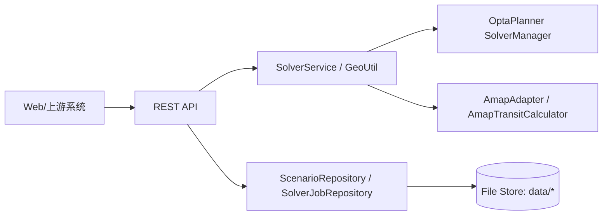
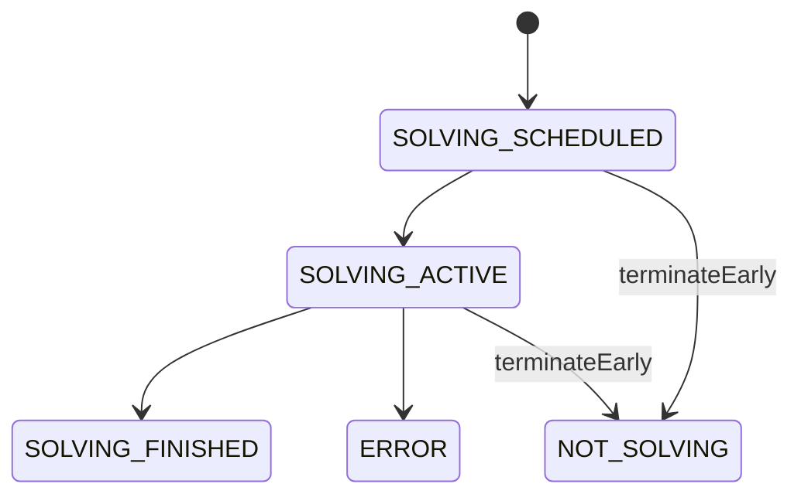

# vrp-0 详细设计文档（Detailed Design）

## 1. 文档信息
- 项目：vrp-0（路径规划与智能派单引擎）
- 版本：v1.0
- 日期：2026-02-26
- 受众：后端/算法工程师、测试工程师、SRE/运维、对接开发
- 代码基准：以 `src/main` 当前实现为准（Quarkus + OptaPlanner + 文件化存储）

---

## 2. 总体目标与范围
### 2.1 总体目标
- 提供“场景管理 + 求解任务管理 + 结果查询/回调 + 结果应用”的完整闭环
- 支持地址 POI 补全与在途矩阵构建（外部地图 / 离线估算）
- 支持多约束 VRP 求解：技能/资质/时间窗/容量/同网点/负载均衡/变更最小等
- 支持可观测与运维：指标、配置查询、矩阵缓存查看/覆盖

### 2.2 范围边界
- 不负责上游工单/人员生命周期，仅消费其输入数据
- 求解是“班次/日级”规划，不承担实时导航改道；动态变化通过重规划实现

---

## 3. 总体架构

- 分层：Resource(API) -> Service -> Repository -> 文件存储
- 关键外部依赖：Amap WebService（POI 检索/路线规划/在途计算）

---

## 4. 核心业务对象（领域模型）
| 对象 | 代码类型 | 责任 | 关键字段（摘要） |
|---|---|---|---|
| 场景 | `db.dto.Scenario` | 规划输入容器、就绪检查、应用结果 | `id,name,planning_date,start_time,end_time,plan` |
| 规划方案 | `domain.RoutePlan` | 求解输入/输出主体 | `depos,agents,tickets,pois,matrix,constraint_configuration,cost_parameter,score` |
| 求解任务 | `db.dto.SolverJob` | 求解过程与结果载体 | `id,scenario_id,status,solve_time,plan,score_explanation,exception,metrics_list` |
| 工程师(按天) | `domain.agent.AgentEachDay` | 规划实体（路线列表变量） | `date,shift_start/off,skills,qualification_levels,capacity,max_ticket_num,tickets` |
| 工单 | `domain.ticket.Ticket` | 事实+部分规划变量（指派、顺序影子变量） | `type,pinned,depo_id,skills_required,qualification_levels_required,time_window,agent,arrival_time` |
| 地点 | `geo.POI` | 地址/坐标抽象 | `id,address,location,cityname,adcode` |
| 在途 | `geo.transit.Transit` | 点对代价 | `distance,duration,create_time` |
| 在途矩阵 | `geo.transit.TransitMatrix` | 点对代价表 | `data[ori][des]=Transit` |

### 4.1 JSON 与序列化约定
- JSON 字段：snake_case（`@JsonNaming(SnakeCaseStrategy)`）
- 时间：`yyyy-MM-dd HH:mm:ss`（多数字段使用 `@JsonFormat`）
- 对象引用：部分集合使用 `@JsonIdentityInfo` + `@JsonIdentityReference(alwaysAsId=true)`（例如 agent.tickets 可能为 ID 列表）
- 特殊 POI：
  - Raw：`poi.id` 为空，表示未解析
  - `POI.NoWhere`：解析失败的哨兵值，视为非法点位

---

## 5. 数据结构设计（关键字段说明）
### 5.1 RoutePlan（输入/输出主体）
- `depos`：网点/仓库列表（包含 `loc: POI`）
- `agents`：工程师（按天），其 `tickets` 有序列表即路线
- `tickets`：工单全集；每个 `ticket.agent` 指向执行工程师（可能为 ID）
- `pois`：场景涉及的所有 POI 去重集合
- `matrix`：在途矩阵（大对象，存储/输出会做裁剪）
- `constraint_configuration`：约束权重配置（Hard/Medium/Soft）
- `cost_parameter`：成本参数，用于 metrics 计算

### 5.2 Ticket（关键业务语义）
- `pinned=true`：求解过程中禁止改派/换序（由 move filter 约束）
- `dep_tickets/ref_tickets`：依赖/关联工单关系（用于时序或同人约束）
- `min_start_time/max_end_time`：时间窗
- `arrival_time`：影子变量（由 `ArrivalTimeUpdatingVariableListener` 随路线变化递推）
- `moved`：只读派生（是否从 original_agent 改派）

### 5.3 AgentEachDay（关键业务语义）
- `shift_start_time/shift_off_time`：班次可用时间段
- `max_ticket_num`：最大接单数
- `transit_loading`：按路线顺序动态计算的在途载荷峰值（用于容量约束）
- `tickets_done_time`：最后工单完成并返程后的结束时间

---

## 6. 持久化设计（文件化“库表”）
### 6.1 目录结构
- 场景：`data/scenarios/{scenario_id}/`
  - `scenario.json`：场景主体（plan 不含 matrix）
  - `meta.json`：索引字段（用于快速查询）
  - `matrix.json.gz`：在途矩阵（gzip）
- 求解任务：`data/solver_jobs/{solver_job_id}/`
  - `job.json`
  - `meta.json`
  - `matrix.json.gz`

### 6.2 一致性与并发
- 每个对象 ID 对应 `ReentrantReadWriteLock`（读写分离）
- 写入采用原子替换：先写临时文件再 `ATOMIC_MOVE`（失败降级为普通 replace）
- 读取后调用 `plan.init()` 恢复运行时引用（matrix 句柄、original_agent/order 等）

---

## 7. 求解器设计
### 7.1 技术选型
- OptaPlanner（多约束 VRP，Hard/Medium/Soft 多层评分）
- 规划实体：
  - `AgentEachDay.tickets` 作为 List 规划变量
  - `Ticket.agent/previous/next/arrival_time` 等为关联变量/影子变量

### 7.2 约束体系（与实现对齐）
约束定义位于 `solver/RoutePlanConstraintProvider`，权重位于 `solver/RoutePlanConstraintConfiguration`：
- Agent 约束：容量上限、最大接单数、技能匹配、资质等级匹配
- Ticket 约束：时间窗惩罚、当日指派、依赖/关联工单约束（部分默认权重为 0 表示未启用）
- 目标函数：最小行驶时间/距离、最小固定成本
- 高级目标：负载均衡、变更最小、虚拟工程师惩罚

### 7.3 固定工单（pinned）
- Local search move 过滤器禁止移动 pinned 工单：
  - `TicketChangeMoveFilter`、`TicketSwapMoveFilter`、`TicketSubChangeMoveFilter`、`TicketSubSwapMoveFilter`

### 7.4 到达时间递推
- `ArrivalTimeUpdatingVariableListener`：当工单指派/顺序变化时，从班次开始或前一工单 departure_time 推导 arrival_time，并级联更新后续工单。

---

## 8. 任务调度方式与状态机
### 8.1 状态定义
`solver/Status`：
- `SOLVING_SCHEDULED`：已提交，等待求解线程
- `SOLVING_ACTIVE`：求解中
- `SOLVING_FINISHED`：求解完成并做完后处理
- `NOT_SOLVING`：未求解/已终止/重启一致化后的状态
- `ERROR`：求解或落库/回调等过程出现异常

### 8.2 调度与终止
- 通过 `SolverManager.solveAndListen(problemId, ...)` 异步求解
- 当出现更优解：更新任务为 `SOLVING_ACTIVE` 并落库（追加 metrics snapshot）
- 终态回调：执行后处理（补全矩阵/路线、生成 score_explanation），再更新为 `SOLVING_FINISHED`
- 早停策略：
  - 系统最大求解时长来自 `solverConfig.xml`（当前 4h）
  - 若请求 `solve_time` 小于最大值，使用 `ScheduledExecutorService` 在到时调用 `terminateEarly`

### 8.3 节点重启一致化
- 启动时将历史任务中 `SOLVING_SCHEDULED/SOLVING_ACTIVE` 重置为 `NOT_SOLVING`（避免“悬挂中”状态）

### 8.4 回调策略
- 若提供 `callback`：求解完成后向该 URL POST `SolverJob`
- 为降低体积与序列化成本：回调前移除 `plan.matrix`
- 异常时仍尝试回调，URL 追加 `is_error=true&error_msg=...`

---

## 9. 地理与在途矩阵
### 9.1 POI 构建
- `GeoUtil.buildPOI(RoutePlan)`：对 Depo/Agent/Ticket 的 raw 地址做解析
- 内置缓存：同地址复用 POI，减少外部调用
- `POI.NoWhere`：表示无法解析，视为非法点位（抛出异常）

### 9.2 矩阵构建模式
- `MatrixMode.MANHATTAN`：离线估算（基于曼哈顿距离 + 分段速度估算）
- `MatrixMode.AMAP`：外部地图修正/计算（受 QPS/配额/超时影响）

### 9.3 缓存矩阵
- `AmapTransitCalculator` 内部维护缓存矩阵（带过期窗口）
- 提供节点级接口查看/覆盖缓存矩阵，便于压测与排障

---

## 10. 接口定义（现有实现）
> 说明：以下为详细设计层面的“接口契约”，功能描述文档不包含路由细节。错误返回统一为 `ErrorInfo{ id, message }`。

### 10.1 场景接口（ScenarioResource）
| 方法 | 路由 | 说明 |
|---|---|---|
| GET | `/scenarios` | 查询场景列表（支持条件与时间窗） |
| POST | `/scenarios` | 创建场景（可选 build POI+矩阵；可选 brief 返回） |
| GET | `/scenarios/{scenario_id}` | 查询场景详情 |
| PUT | `/scenarios/{scenario_id}` | 更新场景（可选 build） |
| DELETE | `/scenarios/{scenario_id}` | 删除场景 |
| GET | `/scenarios/{scenario_id}/solver_jobs` | 查询该场景下任务摘要列表 |
| GET | `/scenarios/{scenario_id}/available_agents` | 2 小时时隙的可用工程师数量 |

关键入参（摘要）：
- `build`：是否构建 POI 与矩阵
- `matrix_mode`：`AMAP` / `MANHATTAN`（建议调用方使用大写，避免枚举解析问题）
- `response_mode`：`full` / `brief`

### 10.2 求解任务接口（SolverJobResource）
| 方法 | 路由 | 说明 |
|---|---|---|
| GET | `/solver_jobs` | 按状态查询任务（默认 SOLVING_ACTIVE） |
| POST | `/solver_jobs` | 提交求解任务（异步），返回任务对象 |
| GET | `/solver_jobs/{solver_job_id}` | 查询任务详情/当前最优解（响应中不返回 matrix） |
| POST | `/solver_jobs/{solver_job_id}/terminate` | 终止求解并返回当前任务信息 |
| POST | `/solver_jobs/{solver_job_id}/apply` | 应用结果到场景（要求集合一致） |
| DELETE | `/solver_jobs/{solver_job_id}` | 删除任务（运行中需先 terminate） |

关键入参（摘要）：
- `solve_time`：ISO-8601 duration（默认 `PT30S`）
- `draw_route`：是否按最终路线补全路线细节
- `callback`：求解完成回调地址
- `response_mode`：`full` / `brief`
- `remove_virtual`：查询详情时可选剔除虚拟工程师指派

### 10.3 辅助接口
| 方法 | 路由 | 说明 |
|---|---|---|
| GET | `/pois` | 关键词检索 POI |
| GET | `/amap_conf` | 查看地图配置 |
| GET | `/matrix` | 查看当前缓存矩阵 |
| POST | `/matrix` | 覆盖当前缓存矩阵 |

### 10.4 错误返回
- 格式：`{ "id": "<uuid 或 null>", "message": "<错误描述>" }`
- HTTP 状态：参数错误 400；资源不存在 404；内部错误 500（含 POI/矩阵未构建等）

---

## 11. 用户界面（概念设计）
> 当前仓库以服务端为主，UI 在此给出“建议实现”，用于联调与验收口径统一。

### 11.1 页面与功能
- 场景管理页
  - 列表查询、创建/编辑/删除、触发 build、查看就绪状态（POI/矩阵）
- 求解任务页
  - 提交求解、按状态筛选、查看进度、终止/删除任务
- 结果可视化页
  - 展示工程师路线（工单顺序）、到达时间、评分与解释、指标曲线
  - 支持“剔除虚拟工程师结果”与“应用到场景”
- 运维页（可选）
  - 查看 Amap 配置、查看/覆盖矩阵缓存、查看节点指标（队列长度/最大求解时长等）

### 11.2 前端交互建议
- 轮询：任务详情与状态每 2-5 秒轮询一次
- 大对象控制：列表页使用 brief/摘要；详情页按需拉 full
- 地图展示：以最终路线补全能力为基础展示 polyline（若启用 draw_route）

---

## 12. 验收规范（单测 / 集成 / UAT）
### 12.1 单元测试（代码级）
- 领域规则：
  - POI/矩阵就绪检查：`Scenario.isPOIBuild/isMatrixBuild`
  - 结果应用一致性：`Scenario.applyRoutePlan` 对 agent/ticket 集合一致性校验
  - 虚拟工程师处理：`RoutePlan.addVirtualAgents/removeVirtualAgents`
  - 固定工单不可移动：move filter 行为（对 pinned 工单）
- 时间递推：
  - `ArrivalTimeUpdatingVariableListener` 对路线变更的 arrival_time 级联更新

> 现状提示：仓库测试存在历史失败记录（见 `doc/ISSUE/vrp-0 单元测试情况.md`），本验收规范以“关键链路可验证”为最低门槛，并建议逐步修复非确定性与外部依赖导致的失败用例。

### 12.2 集成测试（服务级）
- QuarkusTest 覆盖：
  - 场景 CRUD、build、查询窗口可用工程师数
  - 提交求解、查询中间状态、查询最终状态、应用结果、删除任务
- 建议的可重复性策略：
  - 优先使用预置 matrix 的场景文件或 MANHATTAN 模式，避免外部 Amap 依赖

### 12.3 UAT（端到端）
- UAT-1：基础闭环
  1) 创建场景并 build
  2) 提交求解（设置合理 solve_time）
  3) 轮询直到完成
  4) 查看路线/到达时间/评分/解释/指标
  5) 应用到场景并复查
- UAT-2：异常链路
  - POI 未构建/矩阵未构建时提交求解，返回明确错误
  - 删除运行中任务需先 terminate，错误提示明确
- UAT-3：回调链路
  - 成功回调一次；失败回调一次（含 is_error 与 error_msg）
  - 回调体不包含 matrix

---

## 13. 部署与配置（摘要）
- 运行：Quarkus；JDK 21；Gradle；容器部署见 `readme.md`
- 关键配置：
  - 存储目录：`vrp.scenario.store.dir`、`vrp.solverjob.store.dir`
  - CORS：默认全开（内部服务建议配合网关控制）
  - Body 限制：默认 1G（考虑大场景数据）
  - 地图：`amap.app-key` 及其 QPS/配额配置

---

## 14. 已知限制与风险（对齐实现）
- 提交求解为异步：提交接口返回“已调度任务”，调用方需轮询或回调获取最终结果（实现上返回 HTTP 200）
- 大矩阵输出被裁剪：任务详情与回调中不返回 `plan.matrix`，避免体积与性能问题
- 外部地图依赖：Amap 配额/网络波动会影响 POI 与矩阵构建；离线模式可作为降级方案
